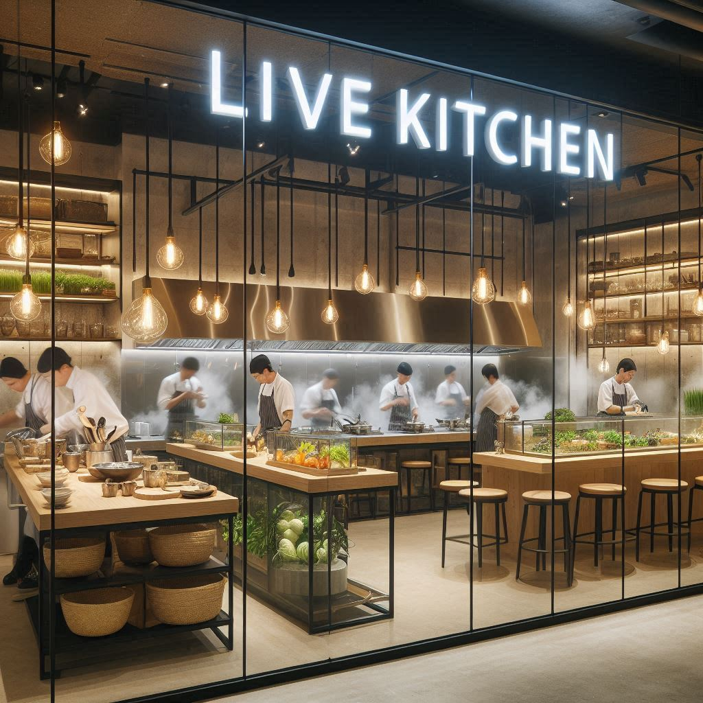
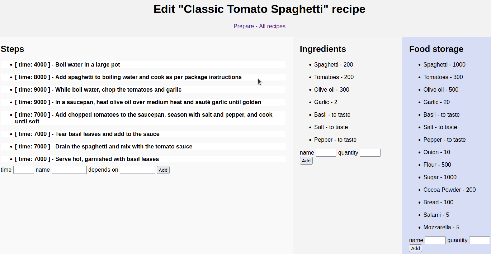
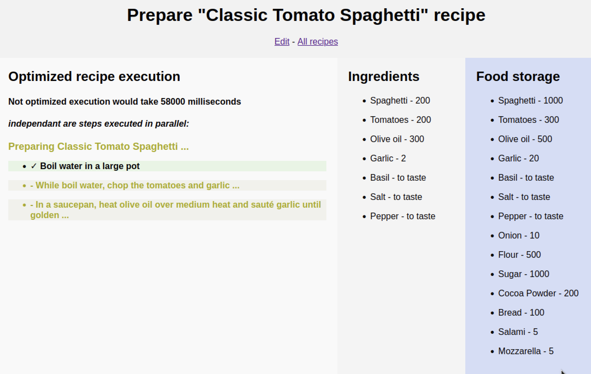
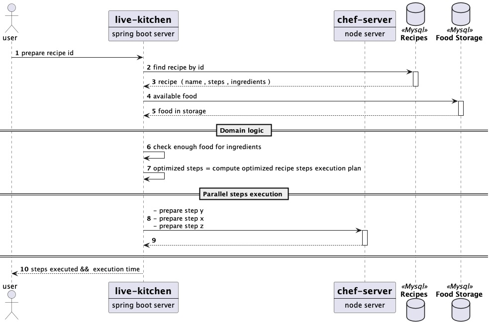

# Live kitchen 

The concept behind the live kitchen application is to create a kitchen environment where activities can be visualized in real-time.  
Imagine a transparent glass wall through which you can observe the kitchen staff working, such as cutting bread or preparing soup.   
This setup allows you to see how efficient and organized the work is.

Features of the Live Kitchen Application:

* Define a food storage system with a list of available ingredients.
* Create recipes, each with a list of required ingredients and a series of steps to complete. Each step has a specific time frame for completion and may depend on one or more other steps.
* Execute the preparation of a recipe, optimizing preparation time by performing independent steps in parallel.
* Indicate recipe preparation failures if there are insufficient ingredients.

This application aims to be a **pseudo-realistic application** by incorporating the following features:

* **Simple but not trivial domain logic**: 
  * The recipe preparation is done to minimise the completion time:
     * Independant steps are executed togheter (in parallel)  to minimise the completion time, 
     * Dependant steps are executed in order.
  * The recipe preparation fails if there is not enought food in the storage for each required ingredient
* **Use of a real remote database (Mysql)**.
* **HTTP calls to simulate the preparation steps** of recipes.
  
  
  

#   
  
  

  

# flow diagram  

# Setup  :

## database setup ( required only once )

1. setup a mysql server in your prefereed way according to datasource setting in application.properties
2. create schema recipes CREATE SCHEMA recipes  
2. create tables with src/main/resources/db/mysql/schema.sql  
3. initialize data with src/main/resources/db/mysql/data.sql  

## chef server setup ( required only once )

1. build image node-chef-server by executing node-chef-server/build.sh
2. run container executing node-chef-server/run.sh

# Run the application 
run the application LiveKitchenApplication or use ./start.sh

# Run the application with cds
1. create_application_with_cds.sh
2. run_application_with_cds.sh.sh

# Run the application with cds and spring aot
1. create_application_with_cds_and_aot.sh
2. run_application_with_cds_and_aot.sh

open browser at http://localhost:8080/allrecipes and choose if to edit or prepare recipes from this page 

